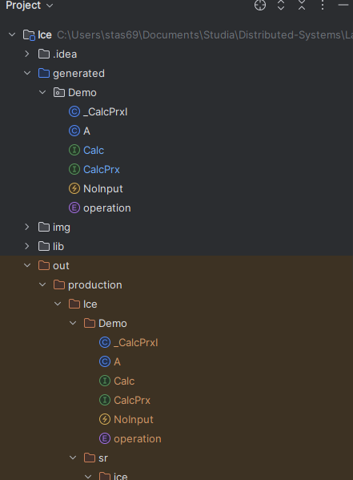
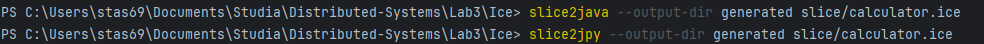
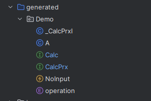
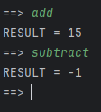
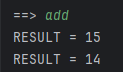
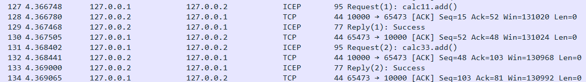
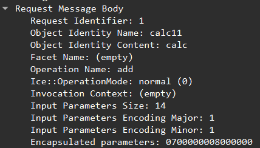
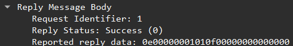
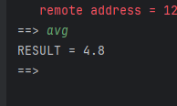
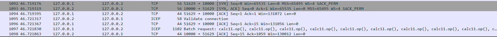

### 1:

### 2:

#ifndef CALC_ICE
#define CALC_ICE

module Demo
{
enum operation { MIN, MAX, AVG };
sequence<long> LongSeq;

exception NoInput {};

struct A
{
short a;
long b;
float c;
string d;
}

interface Calc
{
idempotent long add(int a, int b);
idempotent long subtract(int a, int b);
idempotent double avg(LongSeq numbers) throws NoInput;
void op(A a1, short b1); //załóżmy, że to też jest operacja arytmetyczna ;)
};

};

#endif
### 3:

### 4:

### 5:
W generated znajdują się wygenerowany kod w javie zdefiniowany w pliku .ice oraz kod kalkulatora 
### 6:
Przyjrzałem się
### 7:
Uruchomiłem na portach 10000 tcp i 10000 udp w kodzie
### 8:

### 9:
- tak się nazywają:
  - CalcI calcServant1 = new CalcI();
  - CalcI calcServant2 = new CalcI();
  - CalcI calcServant3 = new CalcI();
- Na początku były 2 a potem 3
  - adapter.add(calcServant1, new Identity("calc11", "calc"));
  - adapter.add(calcServant2, new Identity("calc22", "calc"));
  - adapter.add(calcServant3, new Identity("calc33", "calc"));
- //            calc/calc11:tcp -h 127.0.0.2 -p 10000 -z : udp -h 127.0.0.2 -p 10000 -z"
- adapter.add(calcServant1, new Identity("calc11", "calc"));
- tak //            ObjectPrx base1 = communicator.stringToProxy("calc/calc11:tcp -h 127.0.0.2 -p 10000 -z : udp -h 127.0.0.2 -p 10000 -z"); //opcja -z włącza możliwość kompresji wiadomości
- będzie błąd Ice.ObjectNotExistException
### 10:
			adapter.add(calcServant1, new Identity("calc11", "calc"));
			adapter.add(calcServant2, new Identity("calc22", "calc"));
			adapter.add(calcServant3, new Identity("calc33", "calc"));

Tak wie są różne id:
- com.zeroc.Ice.Identity@757df3ec
- com.zeroc.Ice.Identity@757debac
### 11:
normalnie działa i się dodaje

### 12:

Są w różne base więc poszły 2 requesty i 2 reply 
takie jest body request:

takie jest body replay:

Żeby się połączyć pomiędzy różnymi maszynami należy:
- Ustawić na sewerze adres ip na którym nasłuchujemy (albo 0.0.0.0 jeżeli na wszystkich interface)
- Ustawić na serwerze port na którym nasłuchujemy
- Ustawić u klienta adres ip taki jak ma serwer (jeżeli w sieci lokalnej to taki jaki ma maszyna jeżeli WLAN to taki jaki na zewnątrz)
- Ustawić u klienta port na którym nasłuchuje serwer może byc efeeryczny
### 13:
Zrobiłem to pomiędzy dwoma komputerami w mojej sieci domowej
//			ObjectAdapter adapter = communicator.createObjectAdapterWithEndpoints("Adapter3", "tcp -h 192.168.3.55 -p 10000 -z : udp -h 192.168.3.55 -p 10000 -z");
### 14:
działa 

### 15. Operacje idempotentne:
Wywołanie tej samej operacji z tymi samymi parametrami zawsze kończy się tym samyn
indempotentne:
- GET
- DELETE
- PUT
- add
Nie indempotentne:
- POST
- increment
### 16:
wywołanie add2
### 17:
- Wielkość liczb jest przyczyną opóźnienia funkcje add i subtract są tak zaimplementowane. Odbierany z midleware który nasłuchuje
- Jak mamy dużo danych do przetworzenia a ich wynik nie wypływa na to co się będzie dalej działo
- Nie
### 18:
Zrobiłem tak w configu jest 10 wątków
Adapter1.ThreadPool.Size=10
wcześniej i tak trzebabyło czekać

### 19. Efektywność komunikacji – wywołania oneway:
Wysyłamy tylko w jedną stronę nie dostajemy odpowiedzi
Nie czekamy na potwierdzenie odbioru prze co mniej pakietów w sieci
Nie blokuje klienta
Mogą być tak zrealizowane metody które są void i nie zwracają wyjątków
czyli op
### 20:
trzeba to włączyć

    case "set-proxy datagram":
    obj1 = obj1.ice_datagram();
    System.out.println("obj1 proxy set to 'datagram' mode");
op może być datagramowe
### 21. Efektywność komunikacji – wywołania datagramowe:
op2 jest kompresowane bo zawiera długą wiadomość wiadomości są tylko kolpresowane od danej długości
Gdy usuniemy parametr z obydwie wiadomości nie są skompresowne
### 22. Efektywność komunikacji – agregacja wywołań:
Osczedzamy czas który jest potrzebny na wysłanie wielu requestów po sobie tylko wysyłamy jako jeden większy.
Nie mogą to być operacja która oczekuje odpowiedź czyli albo oneway albo datagram
op może być tak realizowany
różnica polega na tym że zamiast wysyłać każdy request z wywołaniem osobno wysyłay to razem plus nie dostajemy odpowiedzi tylko ack transmisji

W formacie datagram po prostu wysyłamy 

### 23. Efektywność komunikacji – czas podtrzymywania połączenia TCP:
Przy obecnych ustawieniach przy każdej komunikacji jest wymieniany handshake
### 24
Prześledziłem