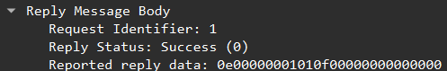

### 12:

Są w różne base więc poszły 2 requesty i 2 reply 
takie jest body request:

takie jest body replay:

Żeby się połączyć pomiędzy różnymi maszynami należy:
- Ustawić na sewerze adres ip na którym nasłuchujemy (albo 0.0.0.0 jeżeli na wszystkich interface)
- Ustawić na serwerze port na którym nasłuchujemy
- Ustawić u klienta adres ip taki jak ma serwer (jeżeli w sieci lokalnej to taki jaki ma maszyna jeżeli WLAN to taki jaki na zewnątrz)
- Ustawić u klienta port na którym nasłuchuje serwer może byc efeeryczny
