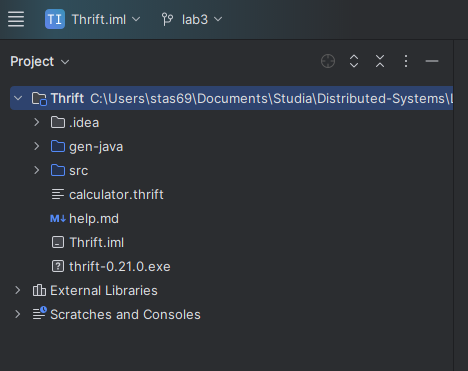
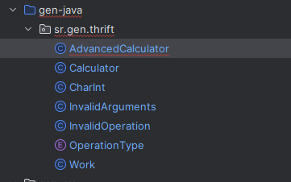

### 1:

### 2:
    thrift --gen java calculator.thrift
tak:
    thrift --gen py calculator.thrift
### 3:
Ok
### 4:

### 5:
- simple działa tylko jeden serwant na jednym orcie
- multiplex działa kilka serwantów  na jednym porcie

### 6:
Moja funkcja
```java
    @Override
public String fun(List<CharInt> pairs) throws TException {
    System.out.println("CalcHandler#" + id + " fun(" + pairs + ")");
    StringBuilder output = new StringBuilder();
    for (CharInt pair : pairs) {
        String ch = pair.getChar();
        int num = pair.getNum();
        output.append(String.valueOf(ch).repeat(Math.max(0, num)));
    }
    System.out.println("DONE");
    return output.toString();
}
```

### 7. Analiza komunikacji sieciowej:
- Json - 45 bytes TCP
- Binary - 30 bytes THRIFT
- Compact - 12 bytes THRIFT
### 8. Zmiana serializacji wiadomości w komunikacji sieciowej:
- Json - 68 bytes TCP 
- Binary - 54 bytes THRIFT TCP Strict binary protocol
- Compact - 45 bytes THRIFT TCP Compact protocol
### 9. Podejście obiektowe czy usługowe?:
nie da się wywołać operacji op ponieważ mimo że korzystamy z advenced calculator to wskazujemy na ten sam obiekt ponieważ po stronie serwera działa tylko jeden obiekt bo mamy ograniczenie w tej formie jeden port jeden obiekt dodatkowo 2 klientów nie może w tym samym czasie korzystać z serwera


### 10. Podejście obiektowe czy usługowe?:
W multiplexie da się korzystać z różnych obiektów.