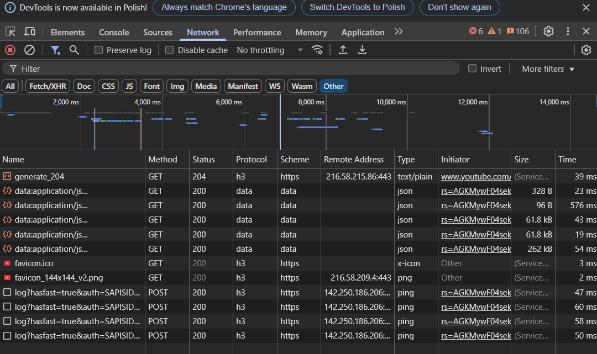

## 1 Podstawy protokołu HTTP/2 (i wzmianka o HTTP/3)
### 4

- w #13 rząda http/1.1
  
- w #15 serwer wybrał protokół h2
### 5:

### 6:

### 7:
główna yt:

### 8:
h3
### 9:
HTTP/3

- Ten nagłówek jest odpowiedzią serwera (np. Google) i sugeruje klientowi, że ta sama usługa może być dostępna przez HTTP/3 (czyli QUIC, UDP) na porcie 443.
- Aby klient (np. Chrome) mógł skorzystać z HTTP/3, musi obsługiwać QUIC – czyli warstwę transportową działającą nad UDP
### 10:
- AGH obsługuje http 1.1
- GitHub obsługuje http 2


## 2 Serializacja Protocol Buffers
### 4:
### 5:

### 6:
    Performing proto serialization 10000000 times...
    ... finished (2549 ms).
    Size of the serialized data: 98 bytes.
### 7:
- Czas serializacji Proto: 2549 ms 98 bytes
- Czas Performing Fury Java serialization: 4768 ms 157 bytes
- Performing default Java serialization: 42336 ms 418 bytes
- Performing JSON serialization: 10479 ms 210 bytes
### 8:
niema typu 2 telefonu


    1: "W\305\202odzimierz Wr\303\263blewski"
    2: 123456
    3: "wrobel@poczta.com"
    4: 0x3ffb6db6db6db6db
    5 {
    1: "+48-12-555-4321"
    2: 1
    }
    5 {
    1: "+48-699-989-796"
    }

### 9:
    name: "W\305\202odzimierz Wr\303\263blewski"
    id: 123456
    email: "wrobel@poczta.com"
    incomePercentage: 1.7142857142857142
    phones {
    number: "+48-12-555-4321"
    type: HOME
    }
    phones {
    number: "+48-699-989-796"
    }
jak widać pola są elegancko nazwane
i income się lepiej wyświetla
### 10:
```java
    repeated float favouriteFloatNumbers = 6;
```
    Size of the serialized data: 112 bytes.

Długość zwiększyła się o 14 bajtów
